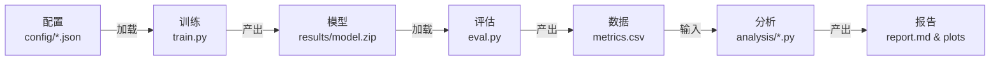

# Task Path 模块详细文档

---

## 📋 目录

1. [模块概述](#模块概述)
2. [实验流程架构](#实验流程架构)
3. [核心脚本详解](#核心脚本详解)
4. [配置系统](#配置系统)
5. [实验设计 (A1-A4)](#实验设计-a1-a4)
6. [使用指南](#使用指南)

---

## 模块概述

Task Path 模块是本项目的**应用层/实验层**，负责定义具体的路径规划任务，管理从训练到评估、分析的完整工作流。它连接了底层的 Engine（物理引擎）、Robot（机器人模型）和 Env（环境接口），通过配置驱动的方式执行系统化的强化学习实验。

### 核心功能

- 🚀 **训练系统**: 集成 Stable-Baselines3，支持 PPO/SAC/TD3 算法
- 📊 **评估系统**: 多维度性能评估，自动记录关键指标
- 📈 **分析工具**: 完整的实验数据分析流水线，自动生成图表和报告
- ⚙️ **配置管理**: 分层配置系统，支持大规模消融实验
- 🔬 **实验体系**: 预定义的 A1-A4 四大实验组

### 目录结构

```
task_path/
├── train.py                  # 训练入口脚本 (范式A核心)
├── eval.py                   # 评估入口脚本 (范式B核心)
├── compare.py                # 模型比较脚本
├── metrics.py                # 性能指标定义 (PathPlanningMetrics)
├── utils.py                  # 通用工具函数 (Config loader, VecEnv)
├── analysis/                 # 实验数据分析子模块
│   ├── analyze_a1_algorithms.py
│   ├── analyze_a2_environment.py
│   ├── visualization.py
│   └── ...
├── configs/                  # 实验配置文件
│   ├── experiments/
│   │   ├── a1_algorithm/     # A1组实验配置
│   │   ├── a2_environment/   # A2组实验配置
│   │   └── ...
└── results/                  # 实验结果存储
    ├── a1/                   # A1组实验结果
    └── ...
```

---

## 实验流程架构

本模块采用基于配置文件的标准实验流程：



### 关键组件交互

- **Utils (`utils.py`)**: 负责加载配置、创建环境、初始化日志
- **Metrics (`metrics.py`)**: 定义统一的评估标准
- **Analysis (`analysis/`)**: 批量处理实验数据，进行跨实验对比

---

## 核心脚本详解

### 1. `train.py` - 训练脚本

负责启动强化学习训练过程。

**主要功能**:

- 读取 JSON 配置文件
- 初始化训练环境（并行）和评估环境
- 初始化 RL 算法（PPO, SAC, TD3）
- 自动设置设备（CPU/GPU）
- 管理日志（TensorBoard, CSV）和检查点保存

**关键特性**:

- **自动设备选择**: 针对 MLP 策略自动选择 CPU（通常更快），避免 GPU 数据传输瓶颈
- **配置固化**: 自动将运行时的配置保存到实验目录，保证可重现性
- **回调机制**: 集成 `EvalCallback` 和 `CheckpointCallback`

### 2. `eval.py` - 评估脚本

加载训练好的模型并在测试环境中进行评估。

**主要功能**:

- 加载保存的模型检查点
- 运行指定数量的测试 Episodes
- 记录详细的轨迹数据和性能指标
- 生成可视化演示（GIF/视频）

### 3. `metrics.py` - 指标计算

定义了路径规划任务的核心评估指标。

**Class: `PathPlanningMetrics`**

| 指标                   | 说明           | 物理含义                              |
| ---------------------- | -------------- | ------------------------------------- |
| `success_rate`       | 成功率         | 到达目标的 Episode 比例               |
| `collision_rate`     | 碰撞率         | 发生碰撞的 Episode 比例               |
| `mean_path_length`   | 平均路径长度   | 机器人实际移动的轨迹长度 (m)          |
| `path_smoothness`    | 路径平滑度     | 轨迹曲率或转折程度的度量              |
| `energy_consumption` | 能量消耗       | 动作幅度的时间积分                    |
| `min_obstacle_dist`  | 最小障碍物距离 | 整个轨迹中离障碍物最近的距离 (安全性) |
| `computation_time`   | 计算时间       | 单步决策的耗时 (实时性)               |

---

## 配置系统

采用分层 JSON 结构，支持覆盖和继承。

**配置示例**:

```json
{
  "env": {
    "task": { "dt": 0.05, "max_episode_steps": 1000 },
    "map": { "obstacle": { "num_obstacles": 5 } },
    "robot": { "mass": 0.5 },
    "sensor": { "num_lidar_rays": 16 }
  },
  "algorithm": {
    "ppo": { "learning_rate": 3e-4, "n_steps": 2048 }
  },
  "training": {
    "total_timesteps": 1000000,
    "seed": 42
  }
}
```

**配置管理 (`utils.py`)**:

- `load_config(name)`: 加载配置
- `validate_config(config)`: 验证参数的合法性（如 dt > 0）

---

## 实验设计 (A1-A4)

本项目预定义了四组核心实验，旨在全面评估系统性能。

### 📌 范式说明

- **范式A (多次训练)**: 探究算法性能、参数敏感性。对应 A1, A3, A4。
- **范式B (泛化测试)**: 探究同一模型在不同环境下的适应性。对应 A2。

### 🧪 A1 (P0): 算法性能对比 (Algorithm Benchmark)

**目标**: 比较不同 RL 算法在路径规划任务上的表现。

- **变量**: 算法 (PPO, SAC, TD3)
- **环境**: 5个难度等级 (L1-L5，障碍物数量逐渐增加)
- **规模**: 3算法 × 5难度 = 15组实验
- **核心指标**: 收敛速度、Success Rate、Path Length

### 🧪 A2 (P0): 环境适应性 (Environment Adaptability)

**目标**: 评估模型对环境变化的鲁棒性（尤其是洋流影响）。

- **变量**:
  - **洋流 (Current)**: 无 (NC)、均匀 (UC)、涡流 (VC)
  - **障碍物 (Obstacles)**: 静态、动态
  - **距离 (Distance)**: 短 (SD)、中 (MD)、长 (LD)
- **关注点**: 在复杂流场中是否仍能保持高成功率和低能耗

### 🧪 A3 (P1): 超参数敏感性 (Hyperparameter Sensitivity)

**目标**: 分析关键超参数对性能的影响，寻找最优配置。

- **变量**:
  - 学习率 (`lr`): 1e-3, 3e-4, 1e-4
  - Batch Size: 64, 128, 256
  - Clip Range (PPO): 0.1, 0.2, 0.3
- **关注点**: 算法对参数的鲁棒性，确定 Sweet Spot

### 🧪 A4 (P1): 奖励函数分析 (Reward Analysis)

**目标**: 研究不同奖励函数设计对策略行为的影响。

- **变量**:
  - `Baseline`: 标准综合奖励
  - `Sparse`: 仅稀疏奖励（只在成功/失败时给分）
  - `Dense`: 密集距离引导奖励
  - `Energy`: 增加能量惩罚权重 (鼓励节能)
- **关注点**: 学习效率、生成的路径形态、能量效率 (Energy Consumption)

---

## 使用指南

### 1. 运行实验

```bash
# 激活环境
conda activate sci3

# 运行 A1 组所有实验 (建议使用脚本批量运行)
python run_batch_experiments.py ----config-dir a1

# 运行单个实验
python task_path/train.py --config configs/experiments/a1_algorithm/exp_a1_l1_ppo.json
```

### 2. 分析结果

```bash
# 生成所有实验的分析报告
python task_path/analysis/generate_full_report.py
```

### 3. 查看报告

分析脚本执行后，报告将生成在 `task_path/results/analysis/` 目录下：

- 打开 `full_experiment_report.md` 查看完整总结
- 在各个子目录（如 `results/a1/analysis/`）查看分组详细报告
